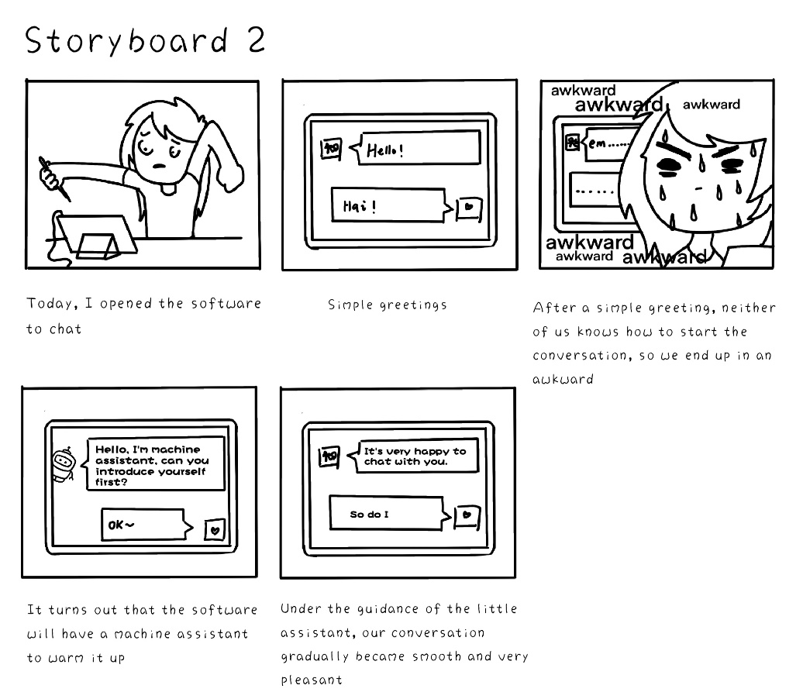
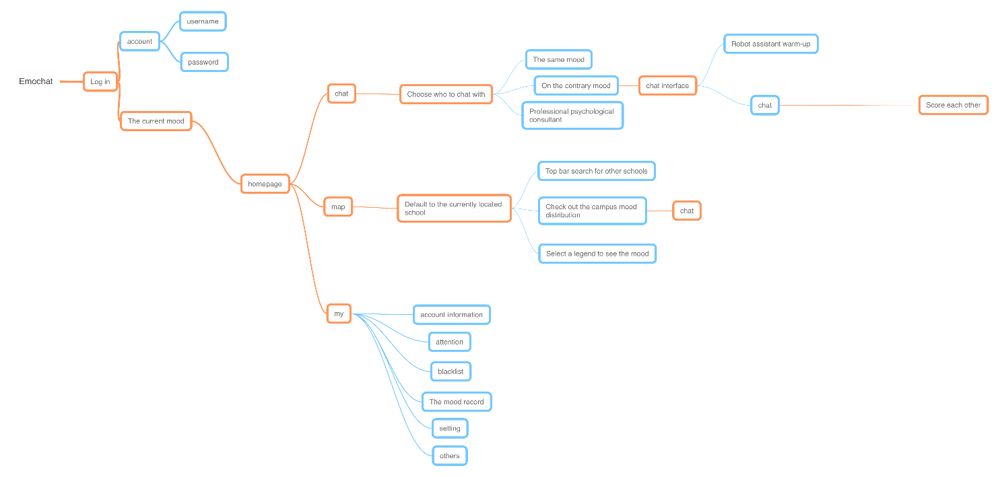

# The Design of EmoChat

*EmoChat is a mobile APP for campus students to chat anonymously based on their emotions. From this report, you can see the design flow of EmoChat with us developers and designers.*

## Introduction

EmoChat is an online chatting app based on emotions, it is designed for contemporary university students who often suffers from emotional fluctuation and internal loneliness. Users enter EmoChat and select their current emotions, using the platform provided by our app, students are free to chat with people who are experiencing the same emotion or just the opposite. We expect that through peer chatting and mutual comforting, negative emotions can be soon eliminated, lonely hearts can be soon warmed and positive emotions can be spread all across the campus.  

## Choose the Design Topic

Our design topic is designing an APP for connecting people together. We held a discussion for collecting ideas, in which Li Min, one of our group member, recalled on her volunteer experience in psychological counseling room and found that many students are not willing to face their mental and psychological problems. So we dicided to design an APP to connect university students by helping with their emotional needs, especially when they are experiencing psychological issues.

## User Analysis
After selecting our design topic, it is clear that the target user of our product is college students. Even though we are in our college time right now, we still have many blind spots about our users. And one cannot design a good product without knowing the users thoroughly. Therefore, we investigated our users, got to know the reason to their emotional fluctuation, what they want and need, what they are concerned about, which can be interpreted as our ***User Analysis***.  

In this stage, we first creat the ***Personas*** of two typical users, Alice and Bob. Next, we analysed their wants and needs to consturct ***Empathy Maps*** respectively. Using the personas and empathy maps,we managed to learn more about our users, and design EmoChat more suitable for university students. Moreover, we conduct 5 ***interviews*** with 5 of our schoolmates respectively to learn their perspectives about dealing with psychological issues and our APP. Based on the personas and interview results, we finally bulit an ***affinity map*** to summarize the users' wants and needs.

### Personas and Empathy Maps
We built two personas for our users. We named these two users as Alice and Bob.  

Alice is an active girl in university. However, as a senior student, she is facing pressure for seeking a job recently. The persona and empathy map of her is shown below. *(Tips: you can click the image to see the pictures in original size)*
  
  

Bob is an introverted student. He suffered study pressure but don't want to talk with classmates. The persona and empathy map of him is shown below. *(Tips: you can click the image to see the pictures in original size)*  
  
  
### Interview
To understand the users better, we designed [*this questionnaire*](../day2/questionnaire.pdf). We interviewed 5 college students in SDU. The full results of each interview are accessible at [*this page*](../day2/interview_results/).

According to the interview, we can conclude that academic stress is the major cause of emotional fluctuation of college students. However, severe emotional fluctuation is not so frequent.  
Depends on personality, most people choose to divert attention from the problems, but sometimes, they need other's help. Most people share emotions with schoolmates and family. And they are more likely to share positive emotions than negative ones. Students usually don't share their feelings to Psychological consultant.  

Most people would accept anonymous chatting because it is emotional supportive while keeping their privacy. But there are some concerns that the other side won’t take them seriously.  

Most people would love to listen to and support others who are in trouble. They usually help friends by indirect actions to relief their mood instead of talking directly to the cause of problem.  

### Affinity Map
According to the personas and interview results, we built an affinity map to analyse the emotional fluctuation of our users. The affinity map is shown below. *(Tips: you can click the image to see the picture in original size)*  
  

## Ideate
In the ideate stage, we designed our product based on our previous user analysis. To begin with, we refined three ***user stories*** to illustrate why users should use our product. Next, we designed the ***sketches*** of UI. Finally, we designed the ***user flow*** to show our feature.  

### User Story
We refined three user stories to help us design the functions of our app.  
These stories are:  

+ Alice needs to chat with someone who feel the same with her anonymously when she is depressed.
  

+ Bob wants this app offer some warming topics when he chats with someone for the first time and doesn't know what to say.  
  

+ Alice would love to share her happiness and help others in need. 
  

From this stories, we can refine the basic functions of our app, chat, warm up and share.  

### Sketch
Based on the refined stories, we can design the functions of our app. *(Tips: you can click the image to see the picture in original size)*   
  

We drew the UI sketches of each function as the picture shows. *(Tips: you can click the image to see the picture in original size)*   
  

### User Flow
We designed the user flow of each function to show the sequence of operation. *(Tips: you can click the images to see the pictures in original size)*    

  

  

  

## Prototype Design
We designed a ***paper prototype*** to illustrate the flow of our app. Paper prototype is a low-fidelity prototype.  
<video width="500" height="400" style="clear:both;display:block;margin:auto" preload="auto" controls>
<source src="../day4/paper_prototype.mp4" type="video/mp4">

Your browser doesn't support HTML5 video. Here is a <a href="../day4/paper_prototype.mp4">link to the video</a> instead.

</video>

## Feedback
In order to get to know the voice of end users, we held twice meetings with Group 1 to listen up their feedback to our product.
### Feedback for Ideate
The first meeting was held after we ideated our product and haven't started to build our paper prototype, so we can refine our project before the paper prototype was made.  

In this meeting, we briefly introduced our product to Group 1, and we mainly discussed the design and sketches of our product.  
Their feedback was:  
+ There are some privacy concerns when chatting to others.
+ EmoMap may disclose the location of users.
+ At the initial stage, there may be only a small group of students using this app. The UX in this period should be carefully considered.

From the critiques of group 1, we can conclude that privacy is still a big concern to users. Privacy is taken into consideration when we designed this app. However, we don’t provide enough signifiers to indicate this.  

After discussion, we refined the design of our app, and added more signifiers to let users feel their privacy is protected properly.  

Firstly, we decide to add a privacy notification page when users start this app for the first time. This page should not use long and dull legal terms. Instead, we use brief introductions with icons and illustrations to tell user their conversation will not be recorded, they have rights to not provide privacy data to us, and their data will not be leaked to others. Meanwhile, Users can set keywords before chatting. When keywords are involved in chatting, the system can warn users to avoid privacy disclosure.  

Secondly, We will ask for users’ permission before their location is shown in EmoChat. In the EmoMap, we will show a distribution diagram instead of a concrete map. We can use heat map to indicate the emotion distribution among campus, so individuals’ location will be protected while keeping the intention of this module.  

Thirdly, we can use some animation in the UI design as signifiers. For example, when the conversation is completed, we will display an animation, showing the content will be burnt or crushed into a ball. These signifiers will let users understand that their conversation will not be recorded.  

As for the UX in the initial stage, we can invite some friends to try our beta version and collect their feedbacks. Also, we can ask users to invite their classmates to join this app. Because our app focuses on campus scenario, we can start advertising and promotion from our campus at the initial stage. Therefore, the number of users will be guaranteed. Moreover, the chatting function will work with only a small group of users, so the lack of user shouldn't affect our UX.

### Feedback for Prototype

After we built the paper prototype, we held the second meeting so they can evaluate our prototype. This time, a method called ***Heuristic Evaluation*** is used to help us improve our prototype. Heuristics listed are the "classic" 10 Usability Heuristics developed by the [Nielsen Norman Group](https://www.nngroup.com/articles/ten-usability-heuristics/).  

The feedback from group 1 is listed at [this file](./heuristic_evaluation.pdf). From this feedback, we can conclude that the general idea is that the design style of our app is simple and clear. Functions and contents are clearly conveyed. However, some elements in the app need annotations. So we will keep improving our application. 